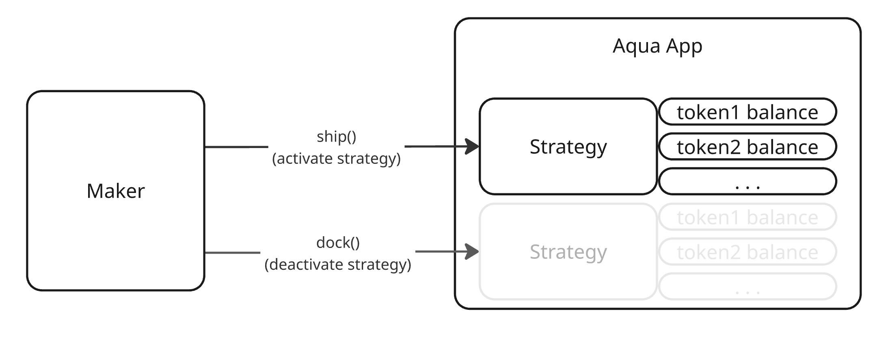
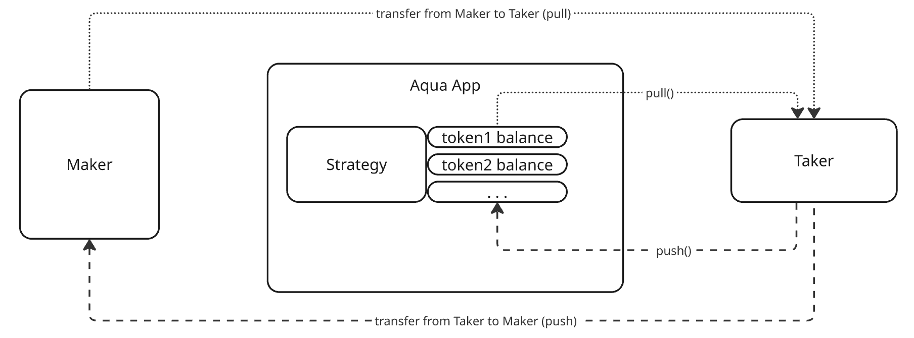
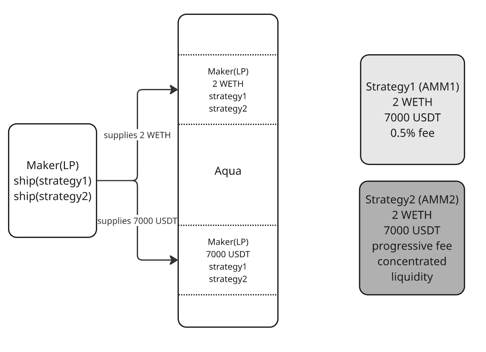

# **Aqua Protocol: How It Works**

## **Abstract**

Managing liquidity in the DeFi space is a complex challenge. Numerous approaches require users to grant permissions to various protocols and switch between them, often resulting in inefficient liquidity use and poor capital efficiency. Users frequently lock liquidity in different protocols while, in many cases, they simply aim to grant permission to a trusted DeFi program (strategy) that operates predictably with their liquidity. Another major challenge in DeFi is enabling liquidity to be used "on demand" without locking it in the protocol. This is crucial for large liquidity providers who prefer not to move their funds from addresses secured by multisigs, hardware protections, etc., while still allowing these funds to participate in multiple DeFi strategies.

Aqua protocol addresses these issues by creating a universal Shared Liquidity Layer. This system allows liquidity providers to granularly manage their liquidity "allowances" for different Aqua Apps and strategies. Using Aqua, they can supply liquidity to multiple strategies simultaneously and create "per-execution-logic" allowances. Aqua is highly gas-efficient and supports many existing off-chain signature schemes, making it compatible with the "account abstraction" paradigm. By combining all these features, Aqua helps build highly composable, multi-strategy DeFi applications with improved composability, capital efficiency and security.

## **Aqua core**

The core of Aqua’s functionality involves storing balances and allowances for various strategies and managing these balances. Let’s begin with the core contract [Aqua.sol](https://github.com/1inch/aqua/blob/a19c99e308cdb9e7d3607e5754e879d293753542/src/Aqua.sol#L12).

First, take a look at the key data [structure](https://github.com/1inch/aqua/blob/a19c99e308cdb9e7d3607e5754e879d293753542/src/Aqua.sol#L25-L28) used in Aqua:

```solidity
mapping(address maker =>
        mapping(address app =>
            mapping(bytes32 strategyHash =>
                mapping(address token => Balance)))) private _balances;
```

This structure represents detailed token balances/allowances granted to strategies by users and apps. Simply put, it can be described as, "I give this strategy an allowance to use 100k of my USDT and 50k of my USDC." From Aqua’s perspective, these are "balances," while from the strategies' perspective, it’s an "allowance" to use the tokens. This approach allows liquidity to be shared across multiple strategies.

Here’s a brief overview of each key in Aqua's balances mapping:

### Aqua Maker (maker)

The first key entity in Aqua protocol is the Maker, the creator (or owner) of an Aqua App. It serves as the first key in Aqua balances, enabling multiple Makers to create similar apps and strategies.

### Aqua App (app)

An Aqua App is the address of a user or smart contract that grants the ability to use its tokens for a specific strategy. It is called an "app" because, in many cases (such as limit orders or swaps), this address is required to perform callbacks.

### Aqua Strategy (strategyHash)

A strategy represents any data that identifies specific execution logic operating with a user's tokens. A good example of a strategy is a piece of parametrized bytecode (with its hash used as an identifier) that performs DeFi operations like swaps or filling limit orders.

### Token balances (token-\>balance mapping)

These are the final balances of tokens. Operations in Aqua interact with these balances, allowing `push()` and `pull()` tokens to and from Aqua.

## Aqua Apps and Strategies

An Aqua App represents programmable logic that operates with Aqua balances. The abstract contract is implemented in [AquaApp.sol](https://github.com/1inch/aqua/blob/a19c99e308cdb9e7d3607e5754e879d293753542/src/AquaApp.sol#L15). These apps can implement any logic leveraging Aqua's `push()` and `pull()` functions.

A vital part of `AquaApp` is its granular reentrancy [locks](https://github.com/1inch/aqua/blob/a19c99e308cdb9e7d3607e5754e879d293753542/src/AquaApp.sol#L27-L31), which can be used separately for each Strategy. For instance, the [\_safeCheckAquaPush](https://github.com/1inch/aqua/blob/a19c99e308cdb9e7d3607e5754e879d293753542/src/AquaApp.sol#L38-L44) function helps Aqua Apps verify token transfers without exposing them to reentrancy attacks. This reentrancy granularity is particularly useful in implementing complex strategies involving hooks, callbacks, routers, and other scenarios requiring intricate contract interactions.

Maker activates and deactivates different Strategies, granting and revoking allowances to Aqua, while Strategies use `pull()` and `push()` operations to update Strategy’s Aqua reserves. This pattern is very useful for creation of multiple immutable strategies, with internal logic, controlled by the Aqua App that uses Maker’s assets only when `pull()` or `push()` happen. 

### Ship/Dock operations

`aqua.ship()` and `aqua.dock()` create and deactivate strategies while managing their reserves. The scheme is demonstrated at the Fig 1:


Here’s how it works using an example:

If you want to create a Uniswap V2 pair for WETH and USDC with custom parameters and reserves, `ship()` accepts:

* **app**: the address of the contract implementing Uniswap V2 AMM logic  
* **strategy**: WETH/USDC token addresses, initial amounts, and fee—these define the specific parameters  
* **aqua balances**: a list of two token addresses and amounts that Aqua uses to supply liquidity to the app and strategy

Aqua then initializes the necessary keys and values, storing two Aqua balances for the app and strategy. The app (e.g., the Uniswap V2 WETH/USDC pair) can now perform swaps using Aqua’s `push()`/`pull()` operations. It’s important to note that multiple strategies (e.g., various USDC trading pairs) can use the same reserves, while any real tokens stay in the Maker’s wallet. 

`dock()` simply clears all Aqua balances for the given strategy without requiring further action.
### 

### 

### 

### Push/Pull operations

`aqua.push()` and `aqua.pull()` are the only operations that interact with actual token balances. `push()` transfers tokens from the user to the Maker's address and updates the user's Aqua balance for the given strategy. `pull()` reverses this operation, transferring tokens back from the Maker and decreasing the Aqua balance. The simplified process is demonstrated at the Fig 2:



As tokens are added or removed via strategies, Aqua balances of tokens adjust accordingly using `push()` and `pull()` operations. It’s important that these balances become available to a Strategy immediately, that allows immediate compounding of incoming funds.

## **Use cases**

Aqua’s major advantage is its ability to share liquidity across multiple strategies. Aqua is compatible with nearly any protocol but is primarily designed for compact, immutable, and trusted strategies that ensure safety while allowing shared liquidity use.

A notable use case includes using Aqua as a shared liquidity source for independent AMMs. Liquidity providers can deploy Aqua strategies in the form of AMM swap pools (e.g., for Uniswap V2, V3, Balancer), where each strategy represents a unique swap pool with a single LP. These pools can be freely `shipped()` or `docked()` as market conditions demand. For instance, LPs can deploy a pool with lower fees to attract more swaps or provide liquidity for exotic tokens and remove it when demand decreases.

Let's demonstrate the initial provision of liquidity to two different AMM strategies by an LP (Fig 2):



Maker supplies 2 WETH and 7000 USDT and *ship()*’s two strategies, implementing two AMMs(AMM1 and AMM2) with different internal logic (fees, invariants, etc…). Both AMMs use the same reserves (2 WETH and 7000 USDT). Now, users can choose one of these strategies (the better one, for example provided by 1inch’s Aggregation Router, that selects the best AMM to perform a swap). 

The process of two users completing swaps via two distinct AMM strategies is shown in Fig 3:

es (multiple tokens)](aqua-setbalances-multiple-tokens.png)

Each swap uses Aqua’s `pull()`/`push()` operations, which adjust Aqua’s balances and transfer tokens between the Maker and Taker in both directions. As a result, Maker's liquidity (2 WETH and 7000 USDT) is utilized in both strategies, allowing the liquidity provider (LP) to earn swap fees from both strategies—provided Maker has sufficient actual WETH and USDC reserves. This ability to use the same liquidity across multiple strategies with varying fees and logic makes Aqua a protocol with the highest capital efficiency. If we denote the capital earning fees as ***Ceff*** and the capital allocated to ***N*** Aqua strategies as ***Calloc***, the following scenarios arise:

- The worst case for Maker occurs when their real token balance is depleted (illiquidity situation) because all swaps are performed in one direction. In this case, ***Ceff \= Calloc***, which mirrors the situation of providing liquidity to any current AMM.  
- The best case occurs when strategies swap in opposite directions, preventing an illiquidity situation. Here, ***Ceff \= N \* Calloc*** (***N*** \- number of strategies).  
- In the intermediate case, where swaps happen in different directions, the effective capital always lies within the range ***Calloc \< Ceff \< N \* Calloc*** and performs more efficiently than any current liquidity provision, provided the strategies are aligned with current market demands.

Aqua can be used not only for swaps but also as a liquidity source for any applications requiring funds “on demand” without locking them, such as borrowing, liquidations, and temporary collateral setups. This functionality is invaluable for aggregators, resolvers, and DeFi services needing dynamic liquidity.

## **Aqua App example**

The best way to illustrate Aqua’s functionality is through a practical example: creating an AMM swap pair with a constant product invariant, providing reserves using Aqua, and conducting swaps via Aqua balances. Consider this [test case](https://github.com/1inch/aqua/blob/a19c99e308cdb9e7d3607e5754e879d293753542/test/XYCSwap.t.sol#L39).

The [setup phase](https://github.com/1inch/aqua/blob/a19c99e308cdb9e7d3607e5754e879d293753542/test/XYCSwap.t.sol#L52-L79) involves deploying Aqua and setting allowances. In this context, we interpret "maker" as the liquidity provider creating an AMM strategy and "taker" as the user leveraging that strategy. The maker [creates a strategy](https://github.com/1inch/aqua/blob/a19c99e308cdb9e7d3607e5754e879d293753542/test/XYCSwap.t.sol#L122) with unique parameters (e.g., reserve tokens, amounts, fee size, and salt). Here is the code snippet for strategy instance creation:

```solidity
strategy = XYCSwap.Strategy({
    maker: maker,
    token0: address(token0),
    token1: address(token1),
    feeBps: FEE_BPS,
    salt: bytes32(0)
});
```

The maker then [ships](https://github.com/1inch/aqua/blob/a19c99e308cdb9e7d3607e5754e879d293753542/test/XYCSwap.t.sol#L91-L96) this strategy using Aqua’s *ship()* function, which stores the token balances enabling strategies to execute swaps via *push()/pull()* operations.

```solidity
aqua.ship(
    // Aqua App and Strategy instance
    address(xycSwapImpl),
    abi.encode(strategy),

    // setting strategy’s reserves (addresses and Aqua token balances)
    dynamic([address(token0), address(token1)]),
    dynamic([INITIAL_AMOUNT0, INITIAL_AMOUNT1])

);
```

The example app [XYCSwap](https://github.com/1inch/aqua/blob/a19c99e308cdb9e7d3607e5754e879d293753542/src/apps/XYCSwap.sol#L12) implements the AMM swap logic([swapExactIn](https://github.com/1inch/aqua/blob/a19c99e308cdb9e7d3607e5754e879d293753542/src/apps/XYCSwap.sol#L51-L72) and [swapExactOut](https://github.com/1inch/aqua/blob/a19c99e308cdb9e7d3607e5754e879d293753542/src/apps/XYCSwap.sol#L74-L95)), calculating amounts using Aqua [balances](https://github.com/1inch/aqua/blob/a19c99e308cdb9e7d3607e5754e879d293753542/src/apps/XYCSwap.sol#L124) and using pull()/push():

```solidity
// _getInAndOut() function uses Aqua balances and uses them as pool reserves
(address tokenIn, address tokenOut, uint256 balanceIn, uint256 balanceOut) =
    _getInAndOut(strategy, strategyHash, zeroForOne);

amountOut = _quoteExactIn(strategy, balanceIn, balanceOut, amountIn);
require(amountOut >= amountOutMin, InsufficientOutputAmount(amountOut, amountOutMin));

// pull() tokens from Aqua to the Taker 
AQUA.pull(strategy.maker, strategyHash, tokenOut, amountOut, to);
```

The [swap](https://github.com/1inch/aqua/blob/a19c99e308cdb9e7d3607e5754e879d293753542/test/XYCSwap.t.sol#L102-L119) itself from the user’s perspective looks like a regular call to a common AMM. Makers can create and deploy various Apps and Strategies working as any existing AMMs but with their own configurations. If these parameters are appealing to users and the strategies are easily accessible (for instance, through *1inch’s Aggregation Router*), this approach enables Aqua AMMs to compete for users more effectively. It enhances the user experience and adjusts liquidity based on market demands more efficiently than existing systems.

## **Conclusion**

This article provides a short overview of how Aqua works. Aqua enables modular and composable DeFi strategies to use shared liquidity across many compact, reliable DeFi applications without the need to lock liquidity in the strategies. Aqua facilitates the management of single token balances across strategies, utilizing them only when necessary.

Liquidity providers retain full control over their funds, able to revoke Aqua allowances at any moment or simply move funds to another address, which disables related strategies without further complications. This feature is especially critical during emergencies, ensuring safety even with potentially buggy protocols.

By supporting off-chain signatures, Aqua offers flexibility for relayers, aggregators, and account abstraction features, expanding its usability across various settings.

These capabilities position Aqua as a robust solution for building next-generation DeFi products. Let’s see where it leads us in the near future\!
